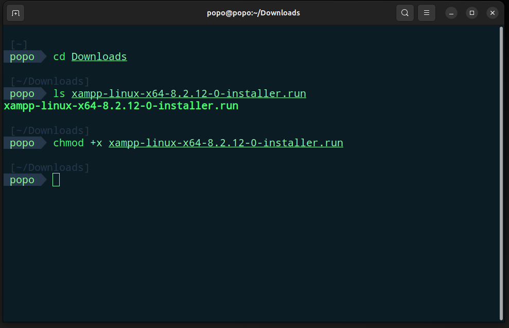
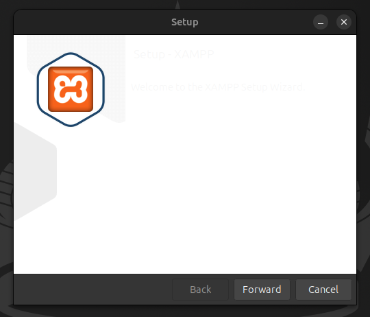
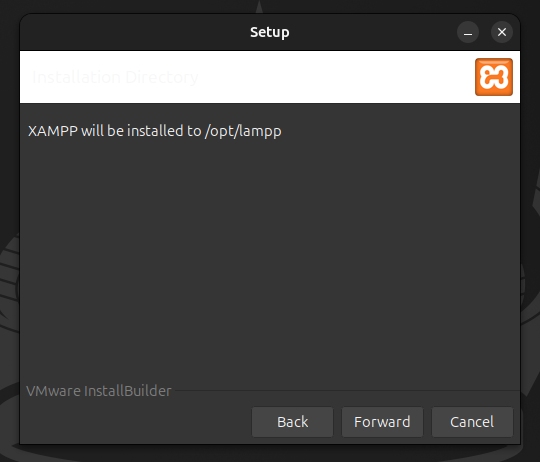
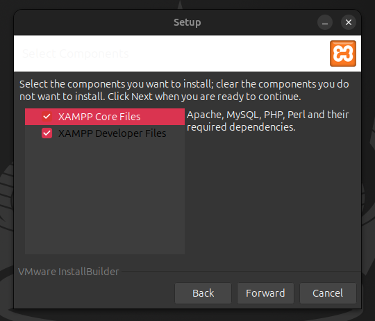

# 🚀 How to install XAMPP in Ubuntu

[🇺🇸 English](./README.md) | [🇹🇭 ภาษาไทย](./README_th.md)

## ⚡ Prerequisites
Before installing XAMPP, ensure you have the following requirements:

1. **🔧 Net Tools Package**
   - Required for network utilities
   - Install using the command:
   ```bash
   sudo apt install net-tools
   ```

2. **💻 System Requirements**
   - Operating System: Ubuntu (any recent version)
   - Minimum 512MB RAM
   - At least 2GB free disk space

## 📝 Installation Steps

### 🌐 Step 1: Download XAMPP
1. Visit the official XAMPP website
2. Download the latest version for Linux
3. Save the installer file

</img>

### 🔑 Step 2: Prepare Installation Package
1. **Navigate to Downloads Directory**
   ```bash
   cd ~/Downloads
   ```

2. **Make Installer Executable**
   ```bash
   sudo chmod +x xampp-linux-*-installer.run
   ```

</img>

### 🛠️ Step 3: Run Installation
1. **Execute the Installer**
   ```bash
   sudo ./xampp-linux-x64-8.2.12.0-installer.run
   ```

2. **Follow Installation Wizard**
   - Click "Forward" to proceed through each step
   - Accept the default settings unless you have specific requirements

</img>
</img>
</img>
</img>
</img>
</img>

### 🚀 Step 4: Launch XAMPP
Run the XAMPP Control Panel:
```bash
sudo /opt/lampp/manager-linux-x64.run
```

</img>

### 📜 Step 5: Automated Launch Script
Create a script to automatically handle service conflicts and launch XAMPP:

1. **Create the Script File**
   Create a file named `manage-services.sh` with the following content:
   ```bash
   #!/bin/bash

   # Function to stop a service
   stop_service() {
       local service_name=$1
       echo "Stopping $service_name..."
       sudo systemctl stop "$service_name"
   }

   # Stop services
   stop_service "apache2"
   stop_service "mysql"

   # Delay for better user feedback
   echo "Waiting for 1 second before starting XAMPP manager..."
   sleep 1

   # Start XAMPP manager
   echo "Starting XAMPP manager..."
   sudo /opt/lampp/manager-linux-x64.run
   ```

2. **Make Script Executable**
   ```bash
   sudo chmod 755 manage-services.sh
   ```

3. **Run the Script**
   ```bash
   ./manage-services.sh
   ```

</img>

---

## 📚 Credits and References

This guide was created with reference to:
- [How to Install XAMPP on Ubuntu](https://phoenixnap.com/kb/how-to-install-xampp-on-ubuntu) by PhoenixNAP
