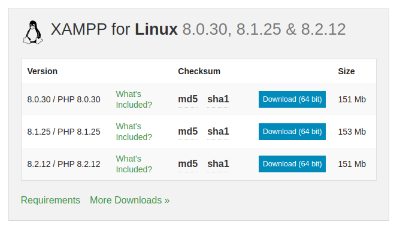
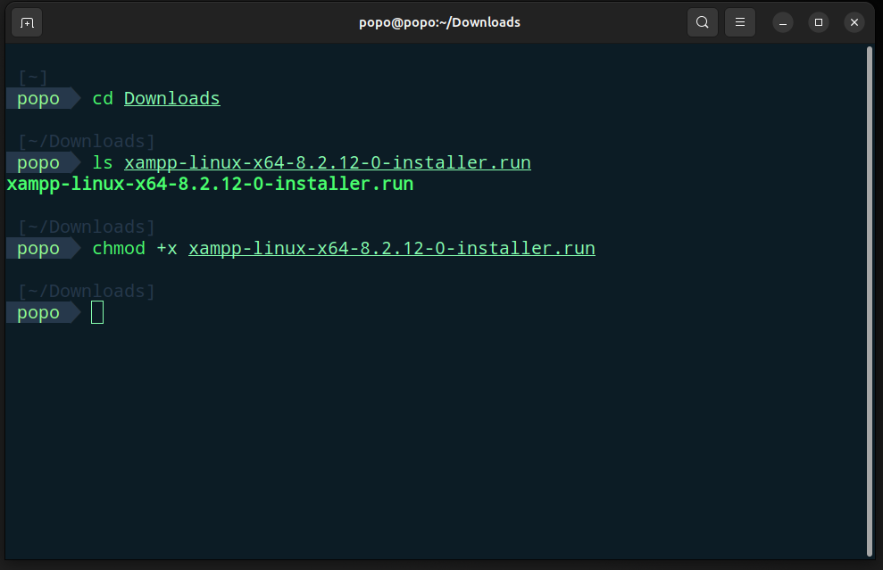
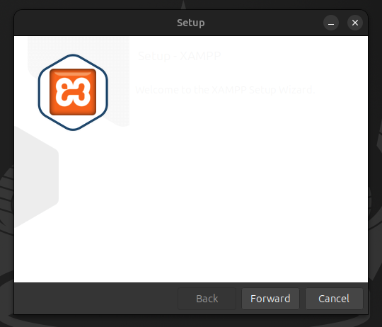
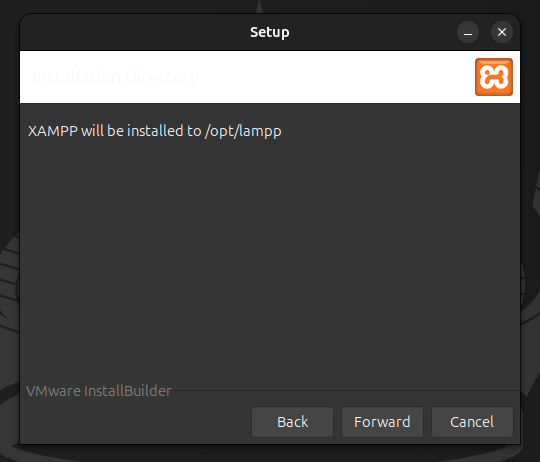
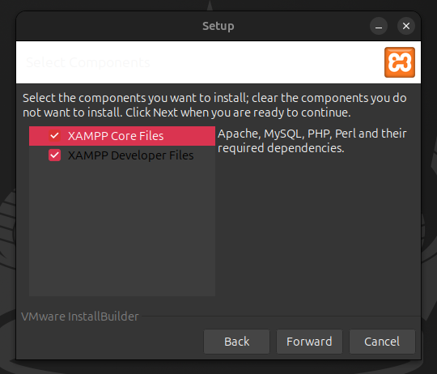
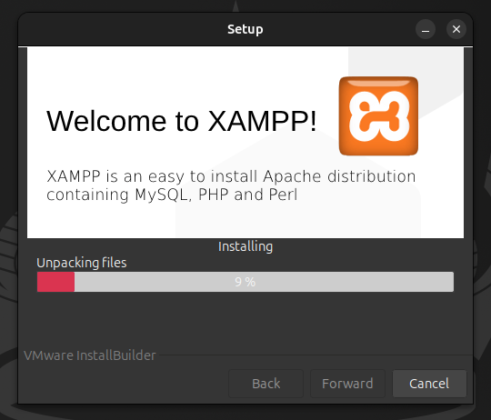
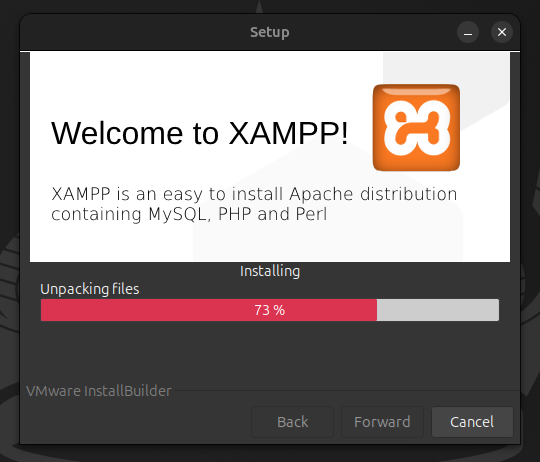
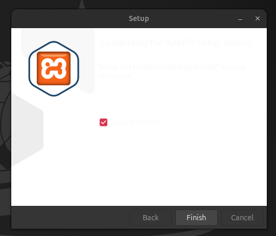
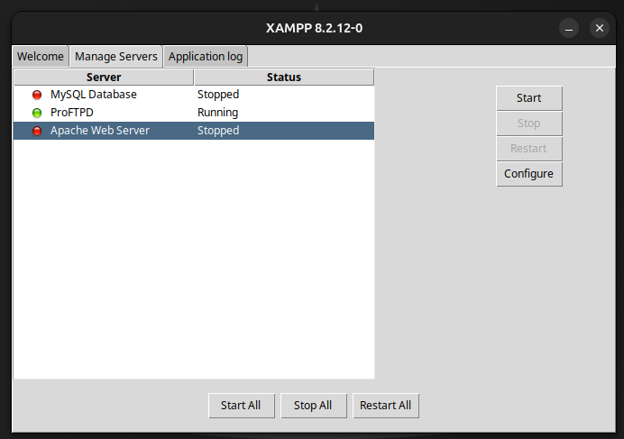
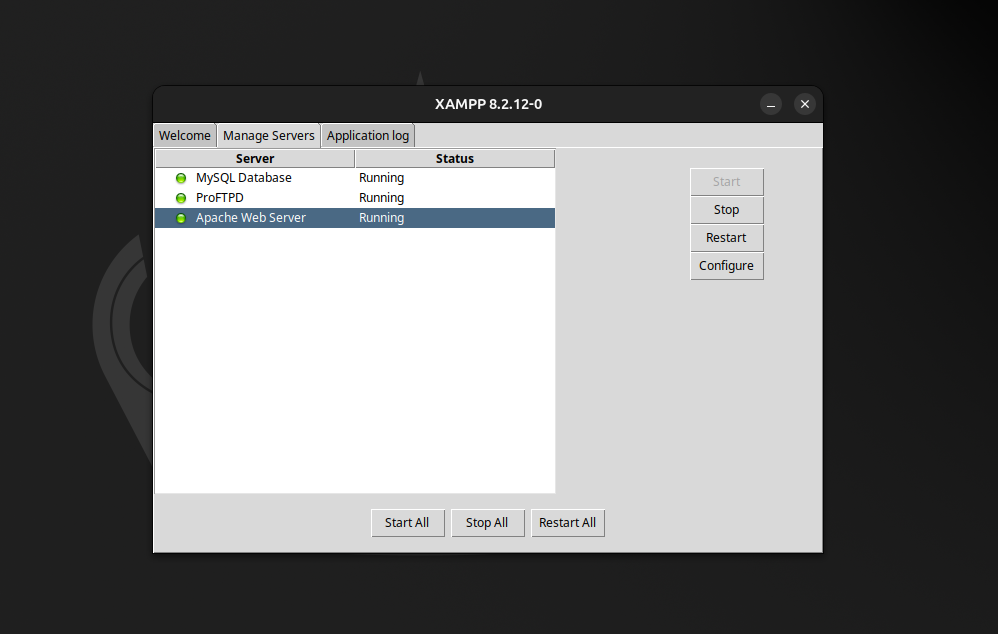

# 🚀 วิธีการติดตั้ง XAMPP ใน Ubuntu

[🇺🇸 English](./README.md) | [🇹🇭 ภาษาไทย](./README_th.md)

## ⚡ ความต้องการของระบบ
ก่อนการติดตั้ง XAMPP โปรดตรวจสอบให้แน่ใจว่าคุณมีสิ่งต่อไปนี้:

1. **🔧 แพ็คเกจ Net Tools**
   - จำเป็นสำหรับยูทิลิตี้เครือข่าย
   - ติดตั้งโดยใช้คำสั่ง:
   ```bash
   sudo apt install net-tools
   ```

2. **💻 ความต้องการของระบบ**
   - ระบบปฏิบัติการ: Ubuntu (เวอร์ชั่นล่าสุด)
   - แรม อย่างน้อย 512MB
   - พื้นที่ว่างในดิสก์อย่างน้อย 2GB

## 📝 ขั้นตอนการติดตั้ง

### 🌐 ขั้นตอนที่ 1: ดาวน์โหลด XAMPP
1. เข้าเว็บไซต์หลักของ XAMPP
2. ดาวน์โหลดเวอร์ชั่นล่าสุดสำหรับ Linux
3. บันทึกไฟล์ติดตั้ง

</img>

### 🔑 ขั้นตอนที่ 2: เตรียมแพ็คเกจติดตั้ง
1. **เปลี่ยนไดเรกทอรีไปยังโฟลเดอร์ดาวน์โหลด**
   ```bash
   cd ~/Downloads
   ```

2. **ทำให้ตัวติดตั้งสามารถรันได้**
   ```bash
   sudo chmod +x xampp-linux-*-installer.run
   ```

</img>

### 🛠️ ขั้นตอนที่ 3: เริ่มการติดตั้ง
1. **รันตัวติดตั้ง**
   ```bash
   sudo ./xampp-linux-x64-8.2.12.0-installer.run
   ```

2. **ทำตามขั้นตอนการติดตั้ง**
   - คลิก "Forward" เพื่อดำเนินการในแต่ละขั้นตอน
   - ยอมรับการตั้งค่าเริ่มต้น เว้นแต่คุณมีความต้องการเฉพาะ

</img>
</img>
</img>
</img>
</img>
</img>

### 🚀 ขั้นตอนที่ 4: เปิด XAMPP
รันแผงควบคุม XAMPP:
```bash
sudo /opt/lampp/manager-linux-x64.run
```

</img>

### 📜 ขั้นตอนที่ 5: สคริปต์สำหรับเปิด XAMPP อัตโนมัติ (หากต้องการ)
สร้างสคริปต์เพื่อจัดการการขัดแย้งของบริการและเปิด XAMPP:

1. **สร้างไฟล์สคริปต์**
   สร้างไฟล์ชื่อ `manage-services.sh` ด้วยเนื้อหาดังนี้:
   ```bash
   #!/bin/bash

   # ฟังก์ชั่นหยุดบริการ
   stop_service() {
       local service_name=$1
       echo "กำลังหยุด $service_name..."
       sudo systemctl stop "$service_name"
   }

   # หยุดบริการ
   stop_service "apache2"
   stop_service "mysql"

   # หน่วงเวลาเพื่อแสดงผลให้ผู้ใช้
   echo "รอ 1 วินาทีก่อนเริ่ม XAMPP manager..."
   sleep 1

   # เริ่ม XAMPP manager
   echo "กำลังเริ่ม XAMPP manager..."
   sudo /opt/lampp/manager-linux-x64.run
   ```

2. **ให้สิทธิ์การรันสคริปต์**
   ```bash
   sudo chmod 755 manage-services.sh
   ```

3. **รันสคริปต์**
   ```bash
   ./manage-services.sh
   ```

</img>

---

## 📚 เครดิตและแหล่งอ้างอิง

คู่มือนี้ถูกสร้างขึ้นโดยอ้างอิงจาก:
- [How to Install XAMPP on Ubuntu](https://phoenixnap.com/kb/how-to-install-xampp-on-ubuntu) โดย PhoenixNAP
