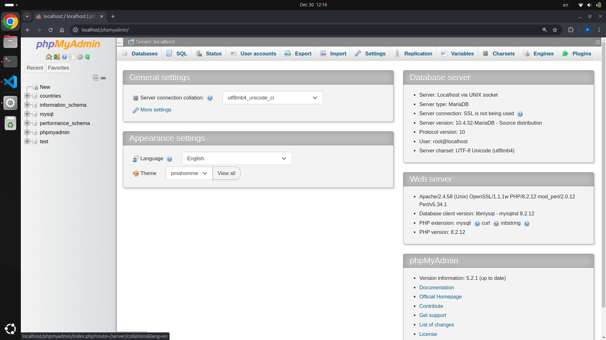

# 🚀 วิธีการติดตั้ง XAMPP ใน Ubuntu

[🇺🇸 English](./README.md) | [🇹🇭 ภาษาไทย](./README_th.md)

## ⚡ ความต้องการของระบบ
ก่อนการติดตั้ง XAMPP โปรดตรวจสอบให้แน่ใจว่าคุณมีสิ่งต่อไปนี้:

1. **🔧 แพ็คเกจ Net Tools**
   - จำเป็นสำหรับยูทิลิตี้เครือข่าย
   - ติดตั้งโดยใช้คำสั่ง:
   ```bash
   sudo apt install net-tools
   ```

2. **💻 ความต้องการของระบบ**
   - ระบบปฏิบัติการ: Ubuntu (เวอร์ชั่นล่าสุด)
   - แรม อย่างน้อย 512MB
   - พื้นที่ว่างในดิสก์อย่างน้อย 2GB

## 📝 ขั้นตอนการติดตั้ง

### 🌐 ขั้นตอนที่ 1: ดาวน์โหลด XAMPP
1. เข้าเว็บไซต์หลักของ XAMPP
2. ดาวน์โหลดเวอร์ชั่นล่าสุดสำหรับ Linux
3. บันทึกไฟล์ติดตั้ง

</img>

### 🔑 ขั้นตอนที่ 2: เตรียมแพ็คเกจติดตั้ง
1. **เปลี่ยนไดเรกทอรีไปยังโฟลเดอร์ดาวน์โหลด**
   ```bash
   cd ~/Downloads
   ```

2. **ทำให้ตัวติดตั้งสามารถรันได้**
   ```bash
   sudo chmod +x xampp-linux-*เวอร์ชันที่ download*-installer.run
   ```

</img>

### 🛠️ ขั้นตอนที่ 3: เริ่มการติดตั้ง
1. **รันตัวติดตั้ง**
   ```bash
   sudo ./xampp-linux-x64-8.2.12.0-installer.run
   ```

2. **ทำตามขั้นตอนการติดตั้ง**
   - คลิก "Forward" เพื่อดำเนินการในแต่ละขั้นตอน
   - ยอมรับการตั้งค่าเริ่มต้น เว้นแต่คุณมีความต้องการเฉพาะ

</img>
</img>
</img>
</img>
</img>
</img>

### 🚀 ขั้นตอนที่ 4: เปิด XAMPP
รันแผงควบคุม XAMPP:
```bash
sudo /opt/lampp/manager-linux-x64.run
```

</img>

### 📜 ขั้นตอนที่ 5: สคริปต์สำหรับเปิด XAMPP อัตโนมัติ (หากต้องการ)
สร้างสคริปต์เพื่อ Reset ในกรณีไม่สามารถใช้งาน Apache และ MySQL ได้:

1. **สร้างไฟล์สคริปต์**
   สร้างไฟล์ชื่อ `manage-services.sh` ด้วยเนื้อหาดังนี้:
   ```bash
   #!/bin/bash

   # Function to check sudo status
   check_sudo() {
    # Check if sudo is available without a password
    sudo -n true 2>/dev/null
    if [ $? -eq 0 ]; then
        return 0 # Sudo is available without password
    else
        return 1 # Sudo needs a password
    fi
   }

   # Ensure sudo privileges
   if check_sudo; then
    echo "Sudo access is already available."
   else
    echo "Please enter your sudo password to continue..."
    sudo -v
    if [ $? -ne 0 ]; then
        echo "Invalid sudo password. Exiting script."
        exit 1
    fi
   fi

   # Reload systemd to prevent warnings
   echo "Reloading systemd daemon to ensure up-to-date service configurations..."
   sudo systemctl daemon-reload

   sleep 1

   # Function to stop a service
   stop_service() {
    local service_name=$1
    echo "Stopping $service_name..."
    sudo systemctl stop "$service_name"
   }

   # Stop services
   stop_service "apache2"
   stop_service "mysql"

   # Delay for better user feedback
   echo "Waiting a second before starting XAMPP manager..."
   sleep 1.5

   # Start XAMPP manager
   echo "Starting XAMPP manager..."
   sudo /opt/lampp/manager-linux-x64.run

   # Final message
   echo "XAMPP is now running! If you encounter issues, try restarting all services using the command: 'sudo systemctl restart apache2 mysql'."

   ```

2. **ให้สิทธิ์การรันสคริปต์**
   ```bash
   sudo chmod 755 manage-services.sh
   ```

3. **รันสคริปต์**
   ```bash
   ./manage-services.sh
   ```

</img>
<p align="center">หากยังพบปัญหาให้ลองกด <strong>Restart All</strong> 🔄 อีกครั้ง.</p>

### 📊 ขั้นตอนที่ 6: แดชบอร์ด
เข้าถึงแดชบอร์ด XAMPP และ phpMyAdmin:
```bash
http://localhost/phpmyadmin/
```
</img>

---

## 📚 เครดิตและแหล่งอ้างอิง

คู่มือนี้ถูกสร้างขึ้นโดยอ้างอิงจาก:
- [How to Install XAMPP on Ubuntu](https://phoenixnap.com/kb/how-to-install-xampp-on-ubuntu) โดย PhoenixNAP
